[← Výběr jazyka](README.md) | [Český návod](README.cs.md) | [English](README.en.md)

# Obrázkový návod

Tenhle návod ukazuje na snímcích z iPhonu tři věci, které je potřeba nastavit: propojení **Google Kalendáře** s **Apple Kalendářem**, kam se v termínu píše **telefonní číslo**, a jak ve **Zkratce vybrat správný kalendář**.

Je to zkrácená obrázková verze. Podrobný popis všech kroků najdete v [českém návodu](README.cs.md).

---

## 1. Připojení Google Kalendáře do iPhonu

Zkratka čte termíny z aplikace **Kalendář** na iPhonu. Pokud objednáváte klienty v Google Kalendáři, stačí mít na iPhonu přidaný Google účet a u něj zapnuté kalendáře. Termíny se pak samy zobrazí i v Apple Kalendáři. **Nic nikam nepřepisujete.**

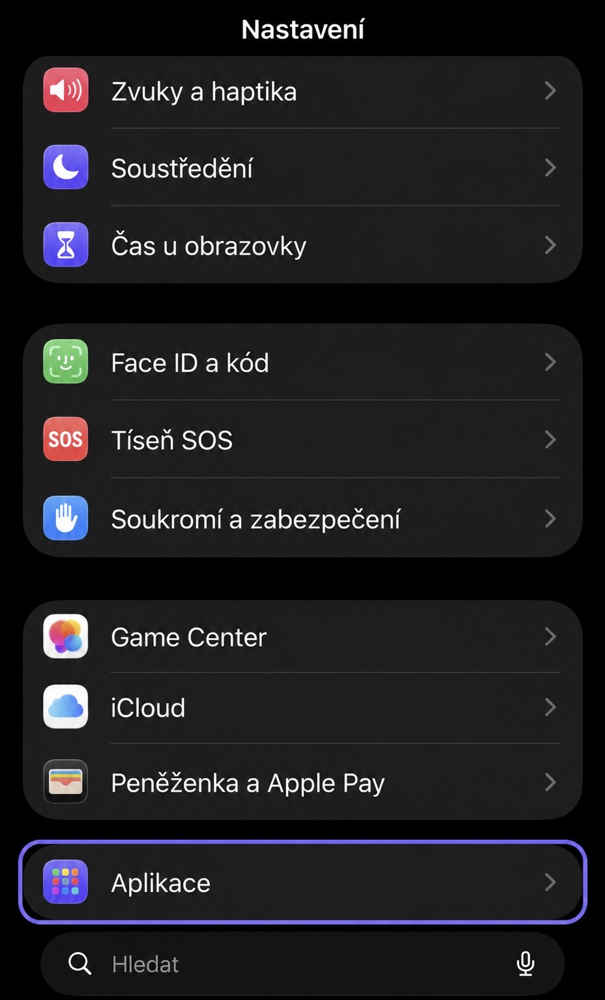

Otevřete **Nastavení** a sjeďte dolů na **Aplikace**.

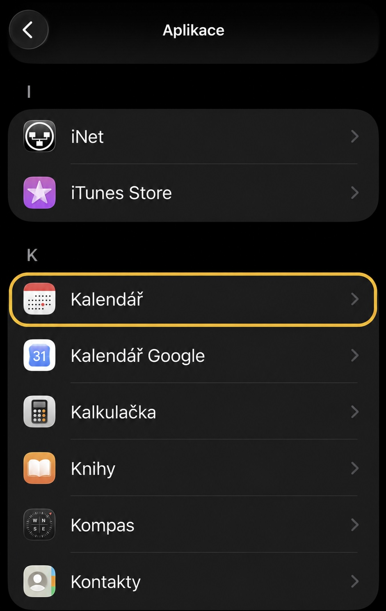

Vyberte **Kalendář** (červená ikona). Pozor, není to *Kalendář Google* hned pod ním.

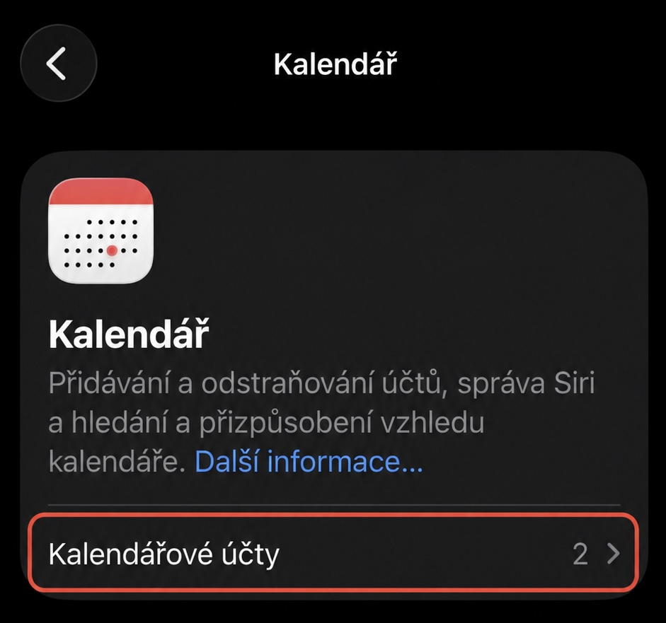

Otevřete **Kalendářové účty**.

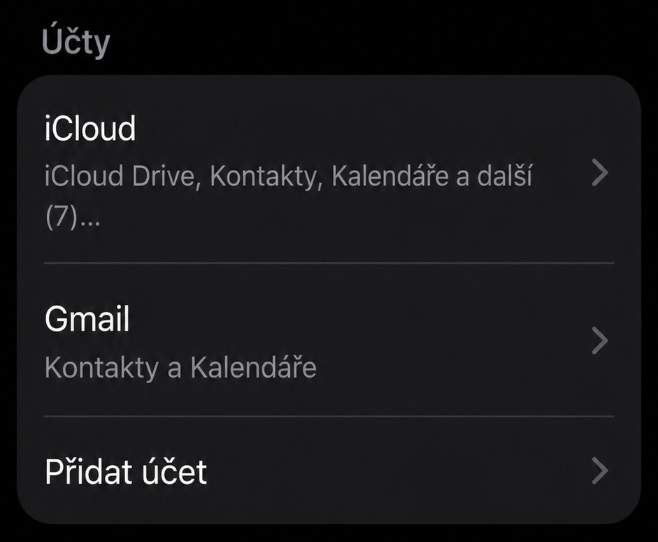

Vyberte svůj **Gmail**. Pokud v seznamu není, klepněte na **Přidat účet** a přihlaste se ke Googlu.

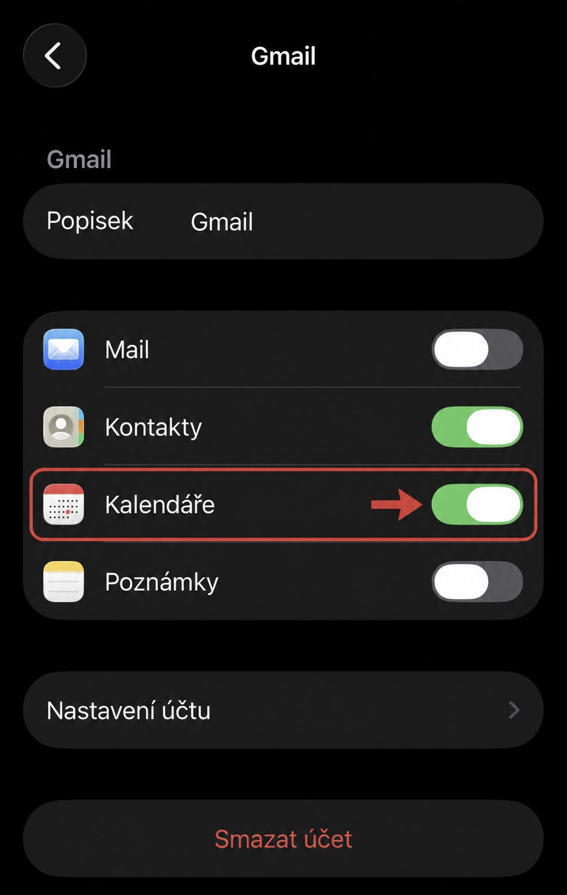

Zapněte přepínač **Kalendáře**. Tím se vaše Google kalendáře propíšou do Apple Kalendáře.

---

## 2. Jak má vypadat termín

Telefonní číslo klienta patří do **textového pole** termínu. V Google Kalendáři se to pole jmenuje **Popis**, v Apple Kalendáři **Poznámky** — ale je to jedno a totéž místo. Odtud si zkratka bere číslo, na které pošle SMS.

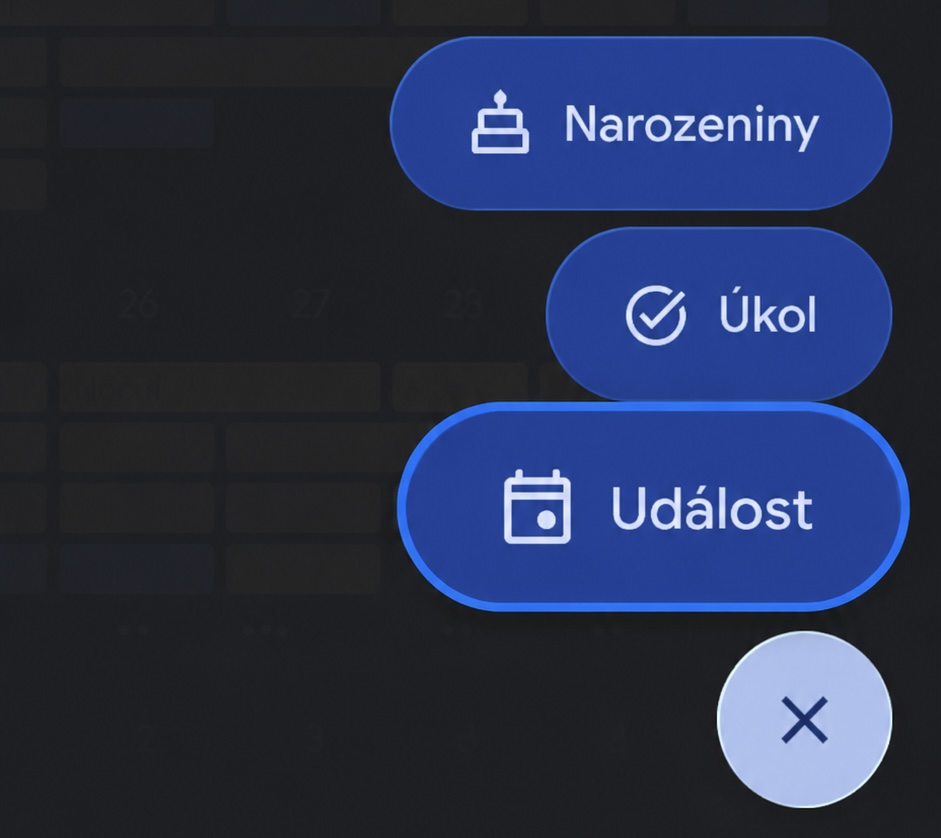

V Google Kalendáři klepněte na **+** a zvolte **Událost**.

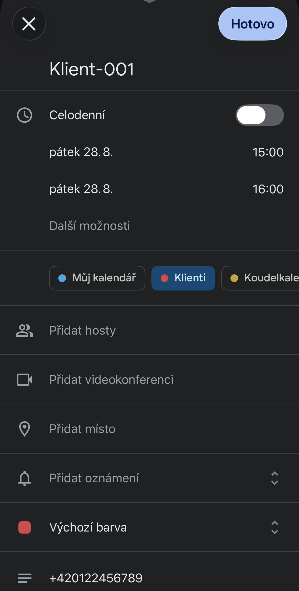

Vyplňte název a čas. Vyberte kalendář, do kterého ukládáte klienty — tady **Klienti**.

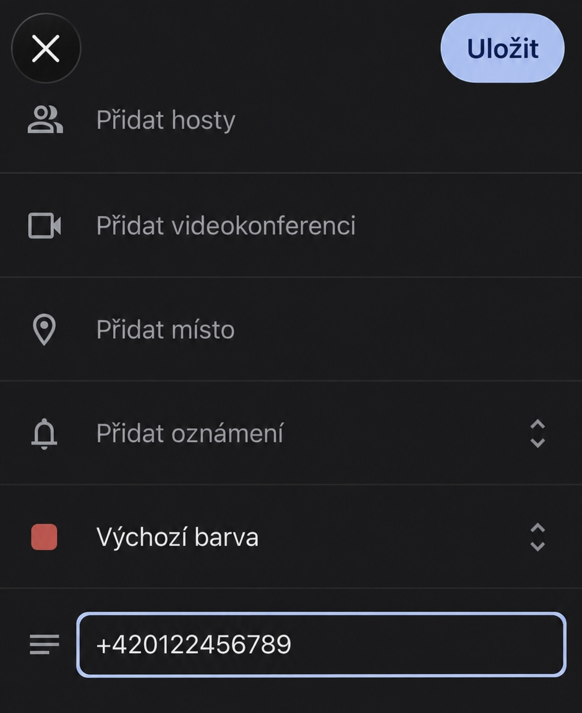

Do pole **Popis** napište telefonní číslo klienta a klepněte na **Uložit**.

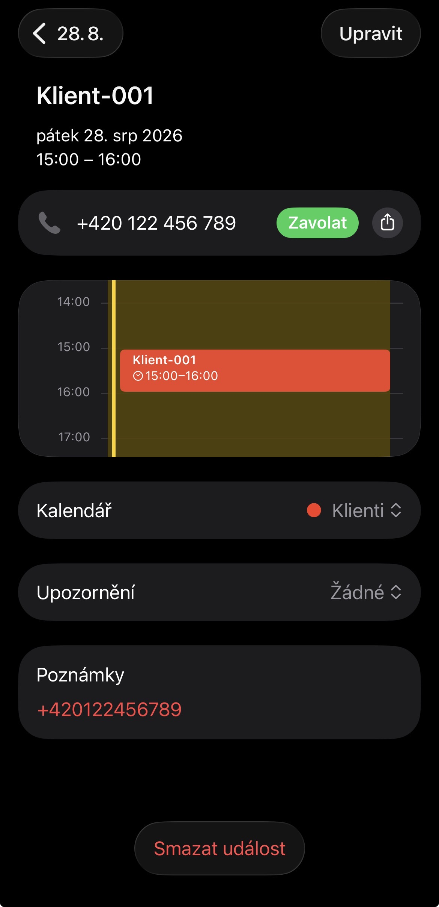

Po synchronizaci uvidíte stejný termín v Apple Kalendáři a číslo v poli **Poznámky**.

- Je to **stejný text**, nemusíte ho psát dvakrát.
- Číslo zadávejte nejlépe v mezinárodním tvaru, například `+420122456789`.
- V poli může být i další text, číslo si zkratka najde sama.
- Termín bez čísla se prostě přeskočí a nic se neodešle.

---

## 3. Výběr správného kalendáře ve Zkratce

Když jsem zkratku vytvářel, nastavil jsem v ní svůj vlastní kalendář. Než ji poprvé použijete, změňte ho proto na svůj kalendář — jinak vaše termíny nenajde.

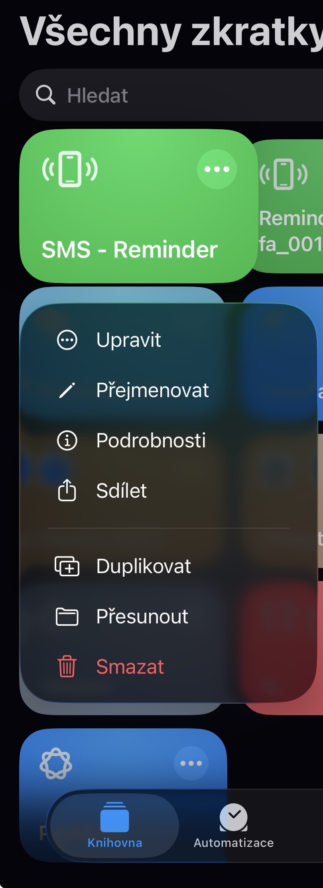

Ve **Zkratkách** najděte zkratku **SMS - Reminder** a otevřete ji přes **⋯ → Upravit**.

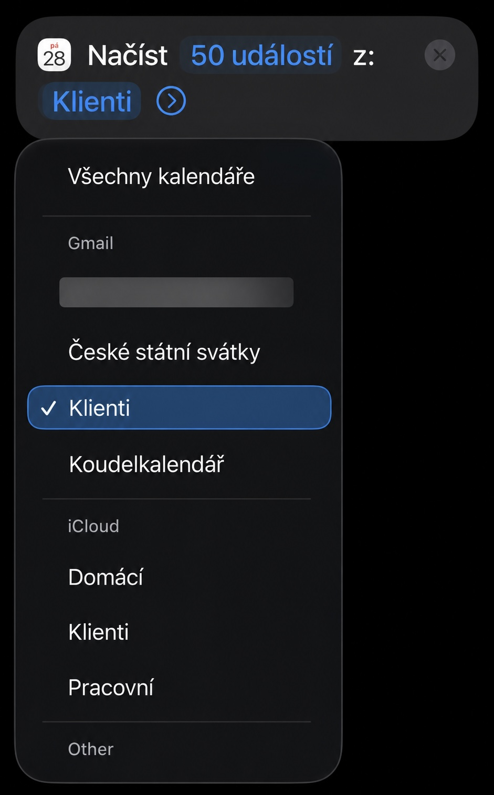

Hned v první akci *Načíst 50 událostí z:* klepněte na název kalendáře a vyberte ten svůj.

- Kalendáře jsou rozdělené podle účtu — zvlášť **Gmail**, zvlášť **iCloud**.
- Na obrázku je **Klienti** dvakrát: jednou pod Gmailem, jednou pod iCloudem.
- Vyberte ten pod správným účtem — tedy ten, do kterého opravdu ukládáte termíny s telefonními čísly (viz krok 2).

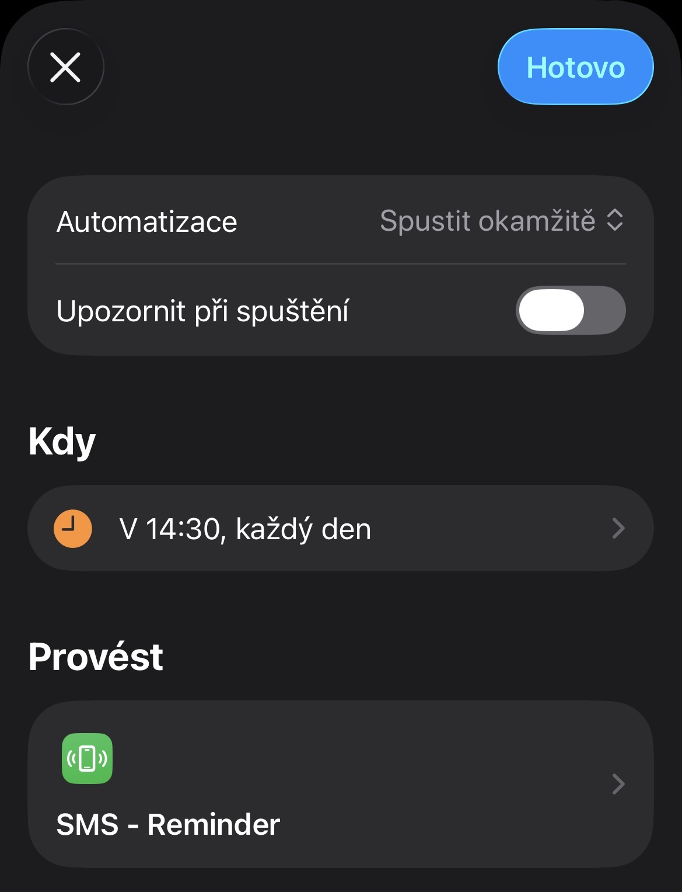

Nakonec si v záložce **Automatizace** nastavte denní spuštění: čas, **každý den** a **Spustit okamžitě**. Postup je popsaný v [kroku 5 českého návodu](README.cs.md).

---

## Hotovo

- Google kalendář je připojený do iPhonu.
- Telefonní číslo je v **Popisu** termínu (v iPhonu v **Poznámkách**).
- Ve Zkratce je vybraný **správný kalendář** ze správného účtu.

Než se na to spolehnete, vytvořte si zkušební termín na zítřek s vlastním číslem a zkratku jednou spusťte ručně.

> **Důležité:** Ruční spuštění projde všechny zítřejší termíny ve vybraném kalendáři a odešle SMS každému, u koho najde telefonní číslo — ne jen tomu testovacímu. Pro bezpečný test buď dočasně přepněte zkratku na prázdný testovací kalendář, nebo si předem ověřte, že žádný jiný zítřejší termín číslo v poznámkách nemá. Podrobný postup bezpečného testu je v [kroku 6 českého návodu](README.cs.md).
